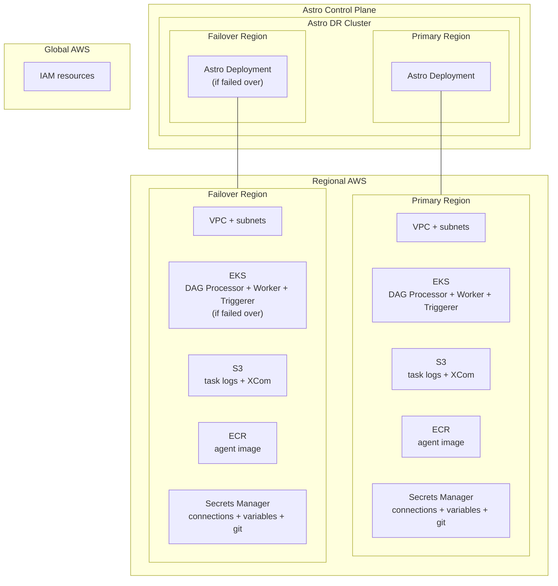

# Astro Remote Execution — Cross-Region Disaster Recovery on AWS

This project deploys an [Astro Remote Execution](https://www.astronomer.io/docs/astro/remote-execution-overview) agent across two AWS regions for cross-region disaster recovery.
A single Terraform apply provisions per-region AWS infrastructure (VPC, EKS, S3, ECR, Secrets Manager) in both a primary and failover region, plus an Astro [cluster](https://cloud.astronomer.io/settings/clusters/cmqzgljvy857s01ny14w7jgpj) with DR enabled and an Astro [deployment](https://cloud.astronomer.io/cm7f419mg0no001jhunzjeer1/deployments/cmqzimj5p876501nyl7x8pktw) backed by both regions.
Flipping `cluster_is_failed_over` in `terraform.tfvars` redirects deployment infrastructure, DAG execution, and task-log storage to the failover region.

## Layout

- [infra/](infra/) — Terraform root module. Provisions global IAM and the Astro cluster/deployment/tokens, and invokes the regional module twice. See [infra/README.md](infra/README.md) for a variable-by-variable reference and optional add-ons (GitDagBundle, OpenLineage, Datadog metrics export).
  - [infra/modules/aws-remote-exec-cross-region/](infra/modules/aws-remote-exec-cross-region/) — wraps both regional invocations and creates the IAM roles shared across regions (development, agent IRSA, Astro orchestration plane).
  - [infra/modules/aws-remote-exec-region/](infra/modules/aws-remote-exec-region/) — per-region resources: VPC, EKS, S3, ECR, Secrets Manager.
- [astro/](astro/) — Astro project (DAGs, Dockerfile, requirements). Built and pushed to each region's ECR by [agent-setup.sh](agent-setup.sh).
- [values.yaml](values.yaml) — Helm values for the `astro-remote-execution-agent` chart. Used for both regional Helm installs; region-specific fields (image tag, S3 bucket, ECR repo, IAM role) are injected on the `helm install` command line by [agent-setup.sh](agent-setup.sh).
- [agent-setup.sh](agent-setup.sh) — End-to-end agent bootstrap. Reads `terraform output`, builds and pushes the agent image to each region's ECR, wires kubeconfig contexts (`primary`, `failover`), creates Kubernetes secrets, installs the Helm chart in both regions, and scales the failover region's deployments to zero so it sits warm-standby.
- [failover.sh](failover.sh) — Fails over from primary to failover: scales failover agent deployments up to 1, then drains and scales the primary agent deployments to 0. Leaves kubectl on the `failover` context.
- [fallback-to-primary.sh](fallback-to-primary.sh) — Reverse of `failover.sh`: scales primary back up to 1, drains and scales failover down to 0, and leaves kubectl on the `primary` context.

## Prerequisites

- AWS CLI configured with SSO
- Terraform >= 1.3.0
- Helm 3+
- kubectl
- Astro CLI
- Docker
- `jq`

```bash
# configure terraform credentials
aws sso login
export ASTRO_API_TOKEN=<your-org-admin-token>

# configure Astro image deployment credentials
astro login
```

## Deploying

1. Apply the Terraform. From [infra/](infra/), copy `terraform.tfvars.example` as `terraform.tfvars` (gitignored) and populate with your details, then:

    ```bash
    terraform init
    terraform apply
    ```

    Per-region outputs are namespaced under `primary` and `failover` (e.g. `terraform output -json primary | jq -r .value.ecr_repo_url`). Global IAM role ARNs, Astro IDs, and agent/deployment tokens are top-level outputs. See [infra/README.md](infra/README.md) for the full variable reference.

2. Run the agent setup script from the repo root:

    ```bash
    bash agent-setup.sh
    ```

    This handles image build/push, kubeconfig, secret creation, and Helm install for both regions. On completion, the primary region is serving task execution and the failover region is scaled to zero.

3. Verify in the Astro UI: Deployment → **Remote Agents**. The primary-region agent should be `Healthy` with a recent heartbeat.

## Failing over

Set `cluster_is_failed_over = true` in [infra/terraform.tfvars](infra/terraform.tfvars) and apply to fail over the Astro cluster (or fail it over in the Astro UI).

Then redirect DAG execution to the failover region with:

```bash
bash failover.sh
```

To fall back to primary, reverse both steps:

Set `cluster_is_failed_over = false`, re-apply, and run the fallback script:

```bash
bash fallback-to-primary.sh
```

## Architecture


