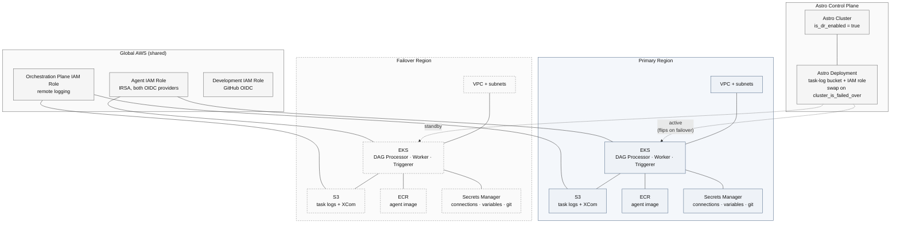

# Astro Remote Execution — Cross-Region Disaster Recovery on AWS

This project deploys an [Astro Remote Execution](https://www.astronomer.io/docs/astro/remote-execution-overview) agent across two AWS regions for cross-region disaster recovery.
A single Terraform apply provisions per-region AWS infrastructure (VPC, EKS, S3, ECR, Secrets Manager) in both a primary and failover region, plus an Astro [cluster](https://cloud.astronomer.io/settings/clusters/cmqzgljvy857s01ny14w7jgpj) with DR enabled and an Astro [deployment](https://cloud.astronomer.io/cm7f419mg0no001jhunzjeer1/deployments/cmqzimj5p876501nyl7x8pktw) backed by both regions.
Flipping `cluster_is_failed_over` in `terraform.tfvars` redirects deployment infrastructure, DAG execution, and task-log storage to the failover region.

## Layout

- [infra/](infra/) — Terraform root module. Provisions global IAM and the Astro cluster/deployment/tokens, and invokes the regional module twice. See [infra/README.md](infra/README.md) for the full walkthrough.
  - [infra/modules/aws-remote-exec-cross-region/](infra/modules/aws-remote-exec-cross-region/) — wraps both regional invocations and creates the IAM roles shared across regions (development, agent IRSA, Astro orchestration plane).
  - [infra/modules/aws-remote-exec-region/](infra/modules/aws-remote-exec-region/) — per-region resources: VPC, EKS, S3, ECR, Secrets Manager.
- [astro/](astro/) — Astro project (DAGs, Dockerfile, requirements)
  - initialized with `astro dev init --remote-execution-enabled --remote-image-repository <ecr-repo-url-from-terraform-output>`
  - built and deployed with `astro remote deploy --platform linux/amd64`
- [values.yaml](values.yaml) — Helm values for the `astro-remote-execution-agent` chart. 
  - Used for both regional Helm installs
  - region-specific fields (image tag, S3 bucket, ECR repo) are populated from `terraform output`.

## Prerequisites

- AWS CLI configured with SSO
- Terraform >= 1.3.0
- Helm 3+
- kubectl
- Astro CLI
- Docker

```bash
# configure terraform credentials
aws sso login
export ASTRO_API_TOKEN=<your-org-admin-token>

# configure Astro image deployment credentials
astro login
```

## Deploying

From [infra/](infra/):

Copy `terraform.tfvars.example` as `terraform.tfvars` (gitignored) and populate with your details.

```bash
terraform init
terraform apply
```

Per-region outputs are namespaced under `primary` and `failover` (e.g. `terraform output -json primary | jq -r .ecr_repo_url`). Global IAM role ARNs and the Astro cluster/deployment IDs are top-level outputs.

Then follow [infra/README.md](infra/README.md) from Step 4 for each region — build/push the agent image to that region's ECR, install the Helm chart against that region's EKS cluster using [values.yaml](values.yaml) tailored to the region, and verify the agent in the Astro UI.

## Failing over

To redirect the deployment to the failover region, set `cluster_is_failed_over = true` in [infra/terraform.tfvars](infra/terraform.tfvars) and re-apply. The Astro deployment's task-log bucket switches to the failover region's S3 bucket; the failover region's agent picks up task execution.

## Architecture


